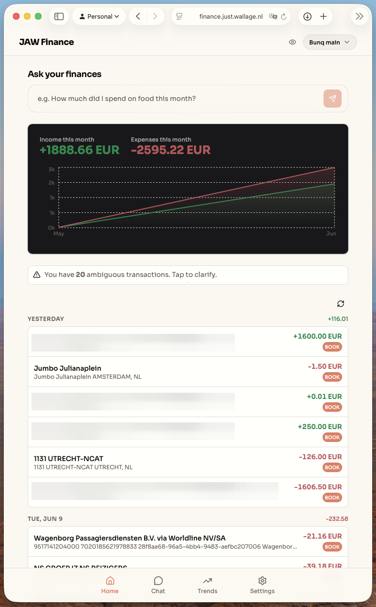
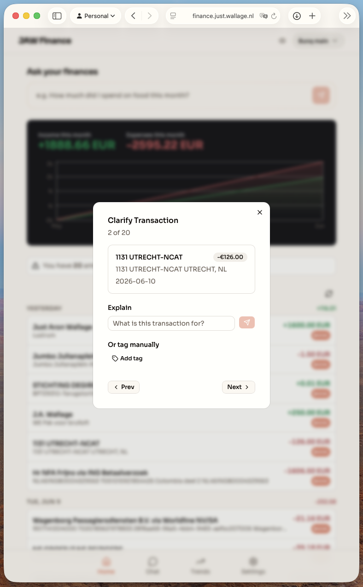
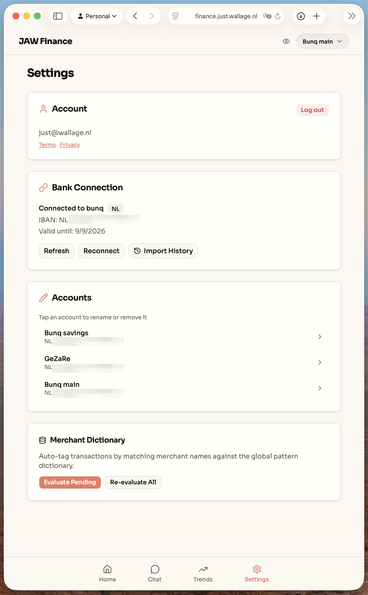
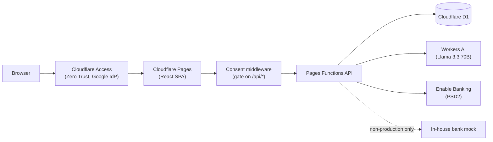
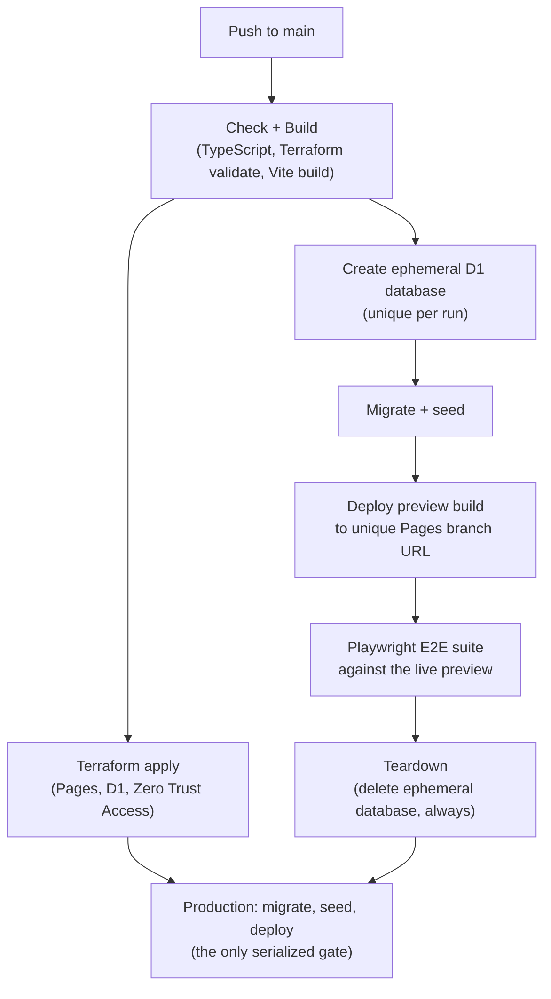

# jaw-finance

A personal finance dashboard that connects to a real bank via PSD2 Open Banking and uses an LLM to tag, query, and explain transactions — built solo to production standards on Cloudflare's edge stack.

[](https://github.com/JustWallage/jaw-finance/actions/workflows/deploy.yml)


> The live app sits behind Cloudflare Access (Zero Trust), so there is no public demo link — the screenshots below show it in action.

## Screenshots

**Dashboard** — income/expense chart cards with live analytics.



**AI auto-tagging** — the LLM proposes tags with reasoning; the user confirms or rejects.

https://github.com/user-attachments/assets/fc4ec756-580f-4c2b-be89-2fddfa98f32f

**Ask your finances** — two-pass natural-language chat answering a real question.

https://github.com/user-attachments/assets/e6f130d6-7515-4ed9-a213-0ef5460a3b89

**Explaining ambiguous transactions** — describe an unclear transaction in plain language and let the AI tag it from that explanation.



**Settings** — merchant dictionary and batch AI evaluation controls.



## Why this exists

This is a real product, not a tutorial project: it connects to an actual bank through Enable Banking (PSD2 Open Banking), and its author uses it daily to track personal finances. It was built solo, end to end — frontend, API, database, AI integration, infrastructure, and CI/CD — to the standard an active company would hold itself to: everything automated, everything tested, nothing deployed by hand.

## Feature highlights

- **Real PSD2 Open Banking integration.** Talks to Enable Banking over REST with RS256-signed JWT authentication and a full OAuth redirect → callback → session flow. A deterministic in-house mock of the bank API (a sibling Pages Function, hard-disabled in production) makes the entire flow testable end-to-end without ever touching a real bank.
- **Self-built frequency-based RAG — no vector database.** Before each AI evaluation, the API queries the user's own history: how often did transactions with this exact description or counterparty carry each tag? Frequencies above a 10% threshold are injected into the prompt as `path (pct%)`. Plain SQL over D1 turns the user's past decisions into the strongest signal the model sees.
- **Two-pass natural-language chat where the LLM never does money math.** Pass 1 translates the question into structured GLOB/date query objects; deterministic SQL computes every number; pass 2 only summarizes the results it is handed. The model decides *what* to query, never *what the answer is*.
- **Hierarchical tagging via materialized paths with leaf-node consolidation.** Tags are slash-separated paths (`food/groceries/albert-heijn`) matched with SQLite's native `GLOB`. Assigning a deeper tag automatically unlinks its ancestors from the transaction, keeping the data model and the UI clean.
- **GDPR/PSD2 consent enforced as global API middleware.** A single middleware gates every `/api/*` request (with minimal explicit exceptions) and returns 403 until the user has a recorded consent — consent is structural, not a checkbox in the UI.

Also in the box: a seeded merchant-pattern dictionary that auto-tags known counterparties on ingestion, batched AI evaluation, and a tag review workflow (unconfirmed → confirmed / rejected, where rejected tags act as a per-user ban list for future AI suggestions).

## Architecture

A React SPA served by Cloudflare Pages, with the API as Pages Functions co-located in the same project. Cloudflare Access (Zero Trust, Google IdP) fronts the API; the app trusts the authenticated identity header it injects, and every database row is scoped to that user. D1 (SQLite at the edge), Workers AI, and Enable Banking are the only external dependencies — there is no server to manage anywhere.



Routes: a public landing page (`/`, plus `/terms` and `/privacy`) and a gated `/app` subtree (dashboard, `/app/chat`, `/app/trends`, `/app/settings`) wrapped in auth and consent gates.

## CI/CD and engineering practices

Trunk-based development on a single `main` branch. Every push runs a fully automated, gated promotion pipeline — no manual deployments, no UI configuration, infrastructure managed by Terraform with remote state in R2.

The E2E stage is the interesting part: instead of testing against a shared, drifting staging database, **every pipeline run creates its own throwaway D1 database**, migrates and seeds it from scratch, deploys a preview build of the app against it on a unique Pages branch URL, runs the full Playwright suite against that *live edge deployment*, and then deletes the database — pass or fail. Production deployment is the only serialized step (a non-cancelling concurrency group), so runs can validate in parallel but promote strictly in order.



Feature branches get the same treatment, opt-in: putting `run-pipeline` in the commit message title triggers check/build plus the full ephemeral E2E run for that branch.

Other practices worth noting:

- **Expand-and-contract database migrations**, applied automatically in the pipeline before each deployment (22 migrations and counting — including a completed provider migration away from an earlier banking API).
- **~2,200 lines of Playwright E2E across 10 specs** with shared custom fixtures. The tests assert real behavior against a live deployment — database state transitions, the AI pending-count decrementing by exactly one after an evaluation, leaf/ancestor tag consolidation — not smoke checks.
- **Deterministic by design**: the in-house bank mock and a mockable AI layer make the E2E suite reproducible in CI and locally, with both strictly disabled in production.

## Tech stack

| Layer | Choice |
|---|---|
| Frontend | React 19, Vite, Tailwind CSS 4, shadcn/ui, react-router, Recharts |
| API | Cloudflare Pages Functions (TypeScript) |
| Database | Cloudflare D1 (SQLite at the edge) |
| AI | Cloudflare Workers AI — `@cf/meta/llama-3.3-70b-instruct-fp8-fast` |
| Banking | Enable Banking (PSD2 Open Banking, REST) |
| Auth | Cloudflare Access (Zero Trust) with Google as IdP |
| IaC | Terraform (Cloudflare provider), remote state in R2 |
| CI/CD | GitHub Actions |
| E2E | Playwright |
| Tooling | pnpm, Husky |

## Local development

```bash
pnpm install

# Frontend only (Vite on :5173)
pnpm dev

# Full stack: Vite + Pages Functions + local D1 (Wrangler on :8788)
pnpm dev:pages

# Apply D1 migrations locally
pnpm migrate:local

# Seed the merchant-pattern dictionary locally
pnpm seed:local

# Static checks (TypeScript + Terraform fmt/validate) and build
pnpm check
pnpm build

# E2E suite (against the local dev servers)
pnpm test:e2e
```

Secrets and identity for local dev:

- Enable Banking credentials go in a `.dev.vars` file at the repo root (loaded automatically by Wrangler). The bundled bank mock means you don't need real credentials to develop or run the tests.
- Set a dev user email in `.env` (`VITE_DEV_USER_EMAIL`) — locally the frontend sends it as the identity header that Cloudflare Access injects in production.

## Project structure

```
.
├── src/          # React SPA (pages, components, hooks)
├── functions/    # Cloudflare Pages Functions
│   ├── api/      # REST API + global consent middleware
│   ├── lib/      # Shared logic: query engine, AI prompt building, tag utils
│   └── mock-enable-banking/   # Deterministic bank mock (non-production only)
├── db/           # D1 migrations, seeds, shared DB types
├── iac/          # Terraform: Pages, D1, Zero Trust Access
├── tests/        # Playwright E2E specs + shared fixtures
└── docs/         # ADRs, stories, research notes
```

## Design decisions

Architecture decision records live in [`docs/adr/`](./docs/adr/) — the why behind the platform choice, the banking-provider migration, the ephemeral-E2E pipeline, and the in-house mock. Day-to-day work is tracked as kanban-as-markdown in [`docs/stories/`](./docs/stories/), and [`CONTEXT.md`](./CONTEXT.md) holds the domain glossary.

## License

**Source-available, all rights reserved.** The code is published so it can be read and evaluated — for review, learning, and hiring conversations. It may not be reused, modified, redistributed, or deployed, in whole or in part. See [LICENSE](./LICENSE) for the exact terms.
